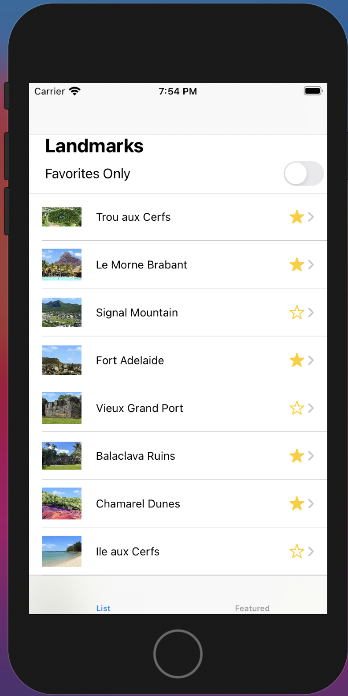
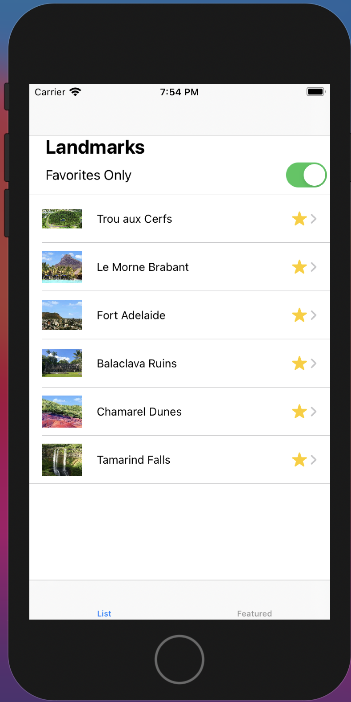
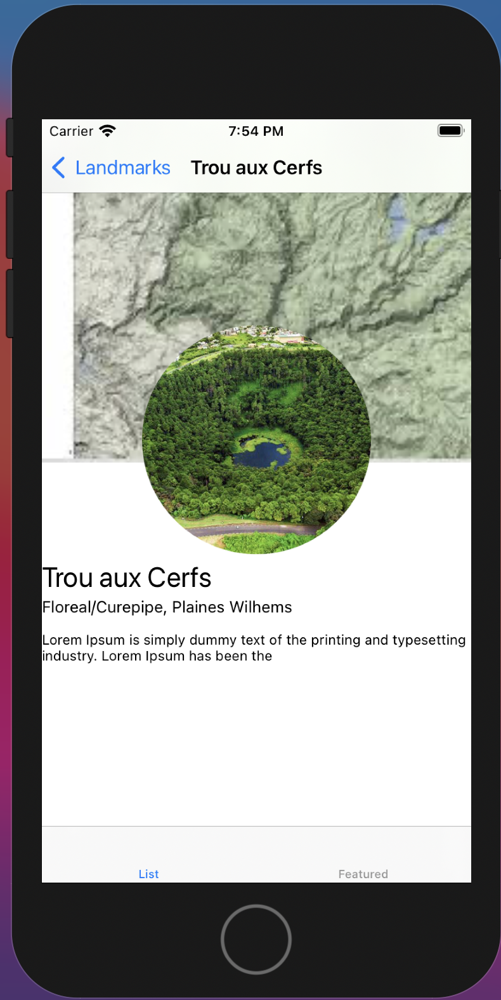

# voyaz
A repository for an IOS app called Voyaz. A learning payground project I am building to learn about IOS app development

## Description

A prototype app which showcases different Mauritius-located landmarks and a corresponding description.

## Screens

### Screen 1: List all landmarks
 

### Screen 2: Filter by favorite landmarks
 

### Screen 3: View Landmark description

